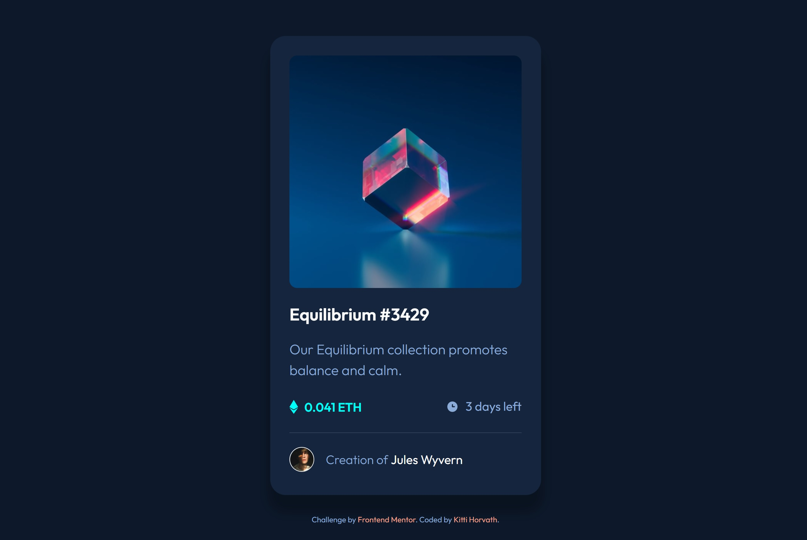

# NFT preview card component solution

This is a solution to the [NFT preview card component challenge on Frontend Mentor](https://www.frontendmentor.io/challenges/nft-preview-card-component-SbdUL_w0U). Frontend Mentor challenges help you improve your coding skills by building realistic projects.

### The challenge

Your challenge is to build out this preview card component and get it looking as close to the design as possible.

You can use any tools you like to help you complete the challenge. So if you've got something you'd like to practice, feel free to give it a go.

Users should be able to:

- View the optimal layout depending on their device's screen size
- See hover states for interactive elements

### Solution Links

- Solution URL: ()
- Live Site URL: ()

## Author

- Frontend Mentor - [@Horv-Kitty](https://www.frontendmentor.io/profile/Horv-Kitty)
